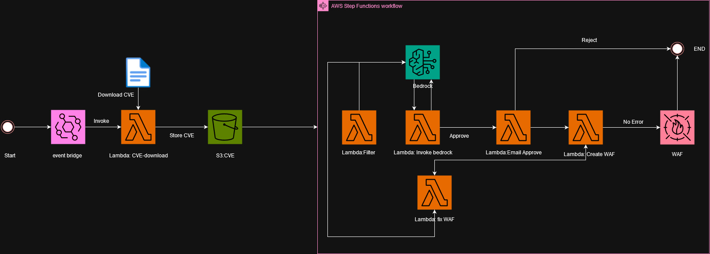
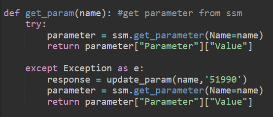

# aws-waf-auto-generate-cloudformation
### Disclaimer ⚠️⚠️⚠️
This project is a demonstration of how generative AI can be intregrated with cyber security. We as a developer of the project do not recomend you to use this project with out any understanding of the system, since doing so can cost a lot of money. This project is decided to reduce workloads of cyber security team, which could also help prevent your system from known exploitation before the system patching can be done.
### project Concept 📖
This project utilized amazon Bedrock which is a foundation model in order to generated aws WAF using Common Vulnerability and Exploit or CVE as an input to create a virtual patching for your website or service. These project is a prove of concept that Generative AI can be implement with cyber security fields to strengthen defense and reduce workload or overhead for cyber security team.
## Architect 🛠️🔧


## Requirement 

- [Python 3.12](https://www.python.org/downloads/), installed
- [AWS Command Line Interface (AWS CLI)](https://docs.aws.amazon.com/cli/latest/userguide/install-cliv2.html) version 2, installed
- [AWS Serverless Application Model (SAM)](https://docs.aws.amazon.com/serverless-application-model/latest/developerguide/serverless-getting-started.html), installed

### Installation ⬇️

The CloudFormation stack must be deployed in the same AWS account and region where a GuardDuty detector has been configured and your EC2 instances are running.

```
git clone https://github.com/siraphopfufu/aws-waf-auto-generate-cloudformation.git
sam build
sam deploy --guided
```
After that input your Email and Owned Resource on system ie. application (not input anything will result in system recognize you have everythings) **AWS region that this project currently work is us-east-1

### How the system works 📑

1. After deployed the project into your account a s3 bucket, a step function, lambda functions, and eventbridge rules will be created
2. You can disable ScheduleRule if you not wish to download CVE every 24 hours, you can run the lambda function DownloadCVEFunction to download CVE.
3. Please check the CVE download number on [Exploit DB](https://www.exploit-db.com/) and edit 